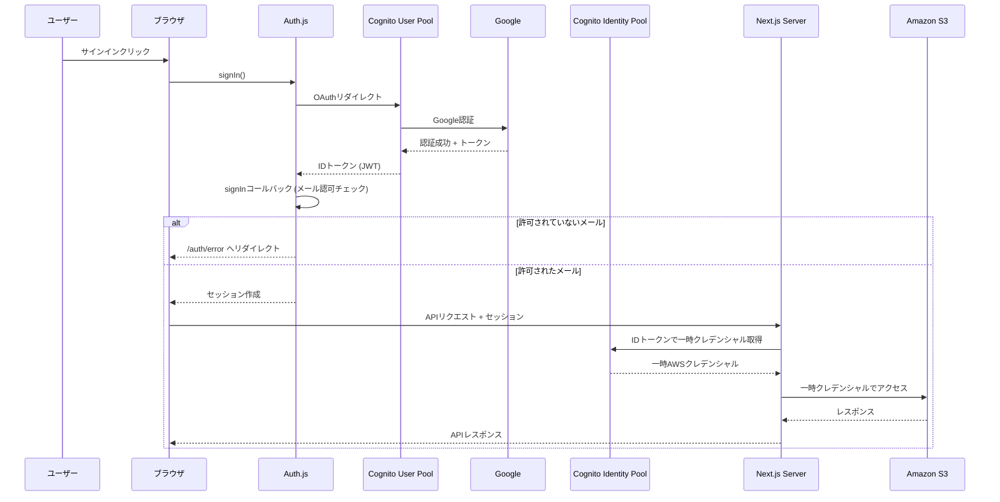

# 認証基盤の変更 (Amazon Cognito)

## 目的

AWSリソースへのアクセス制御をセキュアに行うため、認証基盤をAmazon Cognitoへ切り替える。

.env にAWSのクレデンシャルを書くことは廃止して、一時クレデンシャルを使用する。

## 現状

- フロントエンドでGoogle認証を行っている (Auth.js)
- 静的AWS認証情報（アクセスキー/シークレットキー）を `.env` に保存している
- アプリケーションの認証・認可が適切になされていない
  - 誰でもアップロード可能になっている
  - AWSリソースに対するきめ細やかな認可制御ができていない

## 機能概要

認証プロバイダーとしてAmazon Cognito (User Pool / Identity Pool)を導入する。

ユーザーはCognitoで許可されたGoogleアカウントを用いてCognito User Poolにサインインする。Cognito Identity Poolを通じてAWSの一時クレデンシャルを取得する。

### 参考にするページ

- [Auth.js | Cognito](https://authjs.dev/getting-started/providers/cognito)

## アーキテクチャ

### 認証・認可フロー

## 機能一覧

- Cognito User Pool: ユーザー認証。GoogleをIdPとして連携
- Cognito Identity Pool: 認証済みユーザーに対してAWS IAMロール（一時クレデンシャル）を割り当てる
- IAM Roles: 認証済みユーザー用にS3オブジェクトのCRUD権限を付けたロール
- Lambda Triggers: (Pre-authentication) 特定ドメインやメールアドレスのみログインを許可する制御
- Auth.js signInコールバック: 許可メールリストによる認可チェック

## 変更対象のファイル

### Terraform

- `tools/terraform/main.tf`: Cognito, IAM, S3の定義

### アプリケーション

- `src/features/auth/auth.ts`: Cognitoプロバイダー + signInコールバック
- `src/features/bucket/s3-client-instance.ts`: 一時クレデンシャルでS3クライアントを初期化
- `.env`: 静的AWSキーを削除、Cognito設定を追加

## 環境変数

| 環境変数                   | 取得方法                                       | 説明                               |
| -------------------------- | ---------------------------------------------- | ---------------------------------- |
| `AUTH_COGNITO_ID`          | `terraform output cognito_user_pool_client_id` | アプリクライアントID               |
| `AUTH_COGNITO_SECRET`      | AWSコンソールから取得                          | クライアントシークレット           |
| `AUTH_COGNITO_ISSUER`      | 下記参照                                       | Issuer URL                         |
| `COGNITO_IDENTITY_POOL_ID` | `terraform output cognito_identity_pool_id`    | Identity Pool ID                   |
| `ALLOWED_EMAILS`           | 手動設定                                       | 許可メールアドレス（カンマ区切り） |

`AUTH_COGNITO_ISSUER` の構造は `https://cognito-idp.{region}.amazonaws.com/{cognito_user_pool_id}` となっている。

例: `https://cognito-idp.ap-northeast-1.amazonaws.com/ap-northeast-1_XXXXXXXX`

### 環境変数の取得方法

Terraformで定義されたCognitoリソースから環境変数を取得する。Terraformの設定ファイルがあるディレクトリで `terraform output` を実行する。
